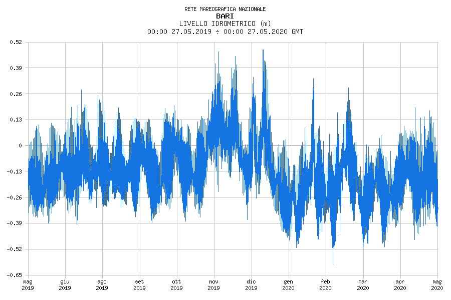

# Mareografie (1) — When above — Alta e bassa marea

### «Mareografie (1) — When above».
«Mareografie (1) — When above» is an **IoT (Internet of Things) device** that gets the current sea level measurements — *alta e bassa marea* — in the nearby of Italian coastal towns, and draws them on a 8X8 LED panel, by turning on/off LED elements continuously and iteratively.

### Technical device

As technical device, «Mareografie (1) — When above» is a remote/mobile ***tide gauge*** — aka *mareograph*, *marigraph*, *sea-level recorder*, or *limnimeter* — to measure the change in sea level — *hydrometric level*.

The device, in its core components:
- Ingests the current — and historical — hydrometric data from the Italian *[**ISPRA**](https://www.isprambiente.gov.it/en/)* - *[Rete Mareografica Nazionale - National Tidegauge Network](http://dati.isprambiente.it/)*. The Italian *ISPRA - Rete Mareografica Nazionale - National Tidegauge Network* is composed of 36 monitoring stations — powered by solar panels — located in Ancona, Anzio, Bari, Cagliari, Carloforte, Catania, Civitavecchia, Crotone, Gaeta, Genova, Ginostra, Imperia, La Spezia, Lampedusa, Livorno, Marina di Campo, Messina, Napoli, Ortona, Otranto, Palermo, Palinuro, Ponza, Porto Empedocle, Porto Torres, Ravenna, Reggio Calabria, Salerno, San Benedetto del Tronto, Sciacca, Strombolicchio, Taranto, Tremiti, Trieste, Valona, Venezia, and Vieste.
- Processes — statistically — the time series of hydrometric level measurements — throught a common data science technique of *discretization over quantiles,* which enrichs data with *historical awareness*.
- Draws — continuously and iteratively — the hydrometric levels over a low-resolution monochromatic 8X8 LED panel, composing a boolean *level matrix*, and displaying it turning on/off the LED elements.

### Emotional artwork

As aesthetical and emotional artwork, «Mareografie (1) — When above» will be — in its final engineering and packaging — **a wall-mountable, portable, or even wearable** — ***tide cronograph***.
Unuseful in beating the asphyxiant *instant time* — measured in minutes, seconds, and even milliseconds — of the financial trades in  late capitalism,  a *tide cronograph* is indispensable to beat another rhythm: the quiet blues of tidal waves — *flusso* and *riflusso* — with their composite — daily and seasonal — sinusoidal breaths.  That's what Antonio Rollo calls  a «***long times' clock***»  («*[orologio dei tempi lunghi](http://www.oistros.it/quandodecidemmodicambiareilmondoconilteatro/orologio-del-tempo-lungo-installazione-pubblica-allaperto-con-fari-led-rgb-e-software-personalizzato/)*», in Italian).

Daily tide breath in Bari, over the last day

Seasonal tide breath in Bari, over the last 12 months

«Mareografie (1) — When above» is also an urgent *timer* about the impacts of human activity on the Earth, shaped by the growing horizon of **climate change and sea level rise**, and involving territories, narratives, knowledges and practices, as John Palmesino and Ann-Sofi Rönnskog write in «[*Oceans in Transformation - When Above*](https://www.e-flux.com/architecture/oceans/331872/when-above/)». «*When above*» comes from the opening lines of the Mesopotamian creation myth Enûma Eliš, inscribed on seven clay tablets in Old Babylonian Akkadian Cuneiform language:
>«*When above, were not raised heavens;
and below on the earth a plant had not grown up;
The abyss also had not broken open their boundaries:
The chaos (or water) Tiamat (the sea) was the producing-mother of the whole of them.
Those waters at the beginning were ordained; but
a tree had not grown, a flower had not unfolded.
When the gods had not sprung up, any one of them;
a plant had not grown, and order did not exist;
Were made also the great gods,
the gods Lahmu and Lahamu they caused to come ...* »

The visual artist Grazia Tagliente is involved in making «*Mareografie (1) — When above*» as a tangible artifact, putting togheter — in a creative assembly — LED panel, IoT electronics, and hand-made precious *gyotaku* printings wich represent typical Mediterranean fishes. Gyotaku — 魚拓, from «*gyo* (fish) and «*taku*» (impression) — is a traditional Japanese method of printmaking of fishes and sea animals, using *sumi* ink and *washi* paper.

### Makers' HOW-TOs

Coming soon!