##### Mareografie (1)

# When above — Alta e bassa marea


+ [«When above — Alta e bassa marea»](#-when-above---alta-e-bassa-marea-)
+ [Technical device](#technical-device)
+ [Emotional artwork](#emotional-artwork)
+ [HOW-TOs](#how-tos)
   - [Hardware components](#hardware-components)
   - [Cable wiring](#cable-wiring)
   - [Raspberry Pi configuration — Enabling SPI peripheral](#raspberry-pi-configuration---enabling-spi-peripheral)
   - [Software installation and running](#software-installation-and-running)

### «When above — Alta e bassa marea».
«*When above — Alta e bassa marea*» is an **IoT (Internet of Things) device** that gets the current sea level measurements — *alta e bassa marea* — in the nearby of Italian coastal towns, and draws them on a 8X8 LED panel, by turning on/off LED elements continuously and iteratively.

| . | . | . | . |
| :--- | :--- | :--- | :--- |
| 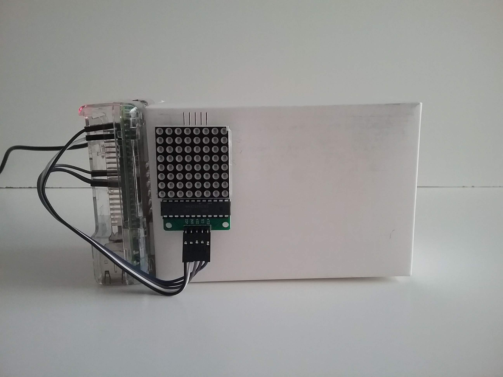 | 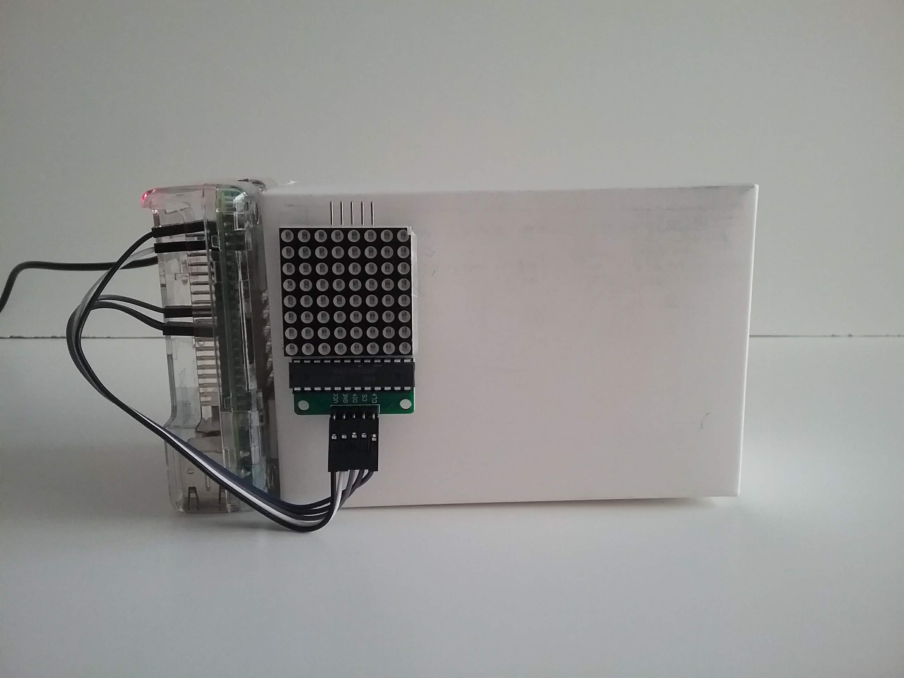 | 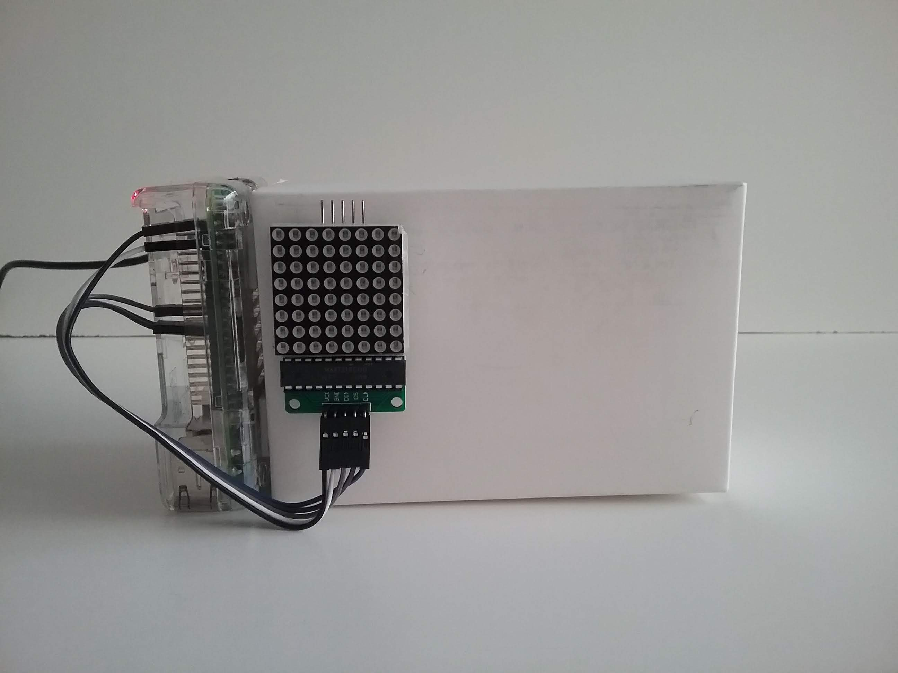 | 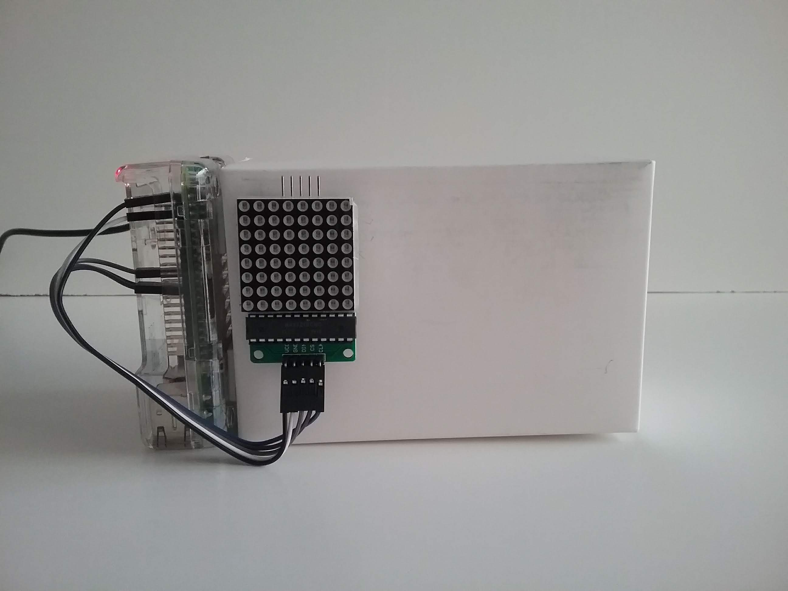 |
| 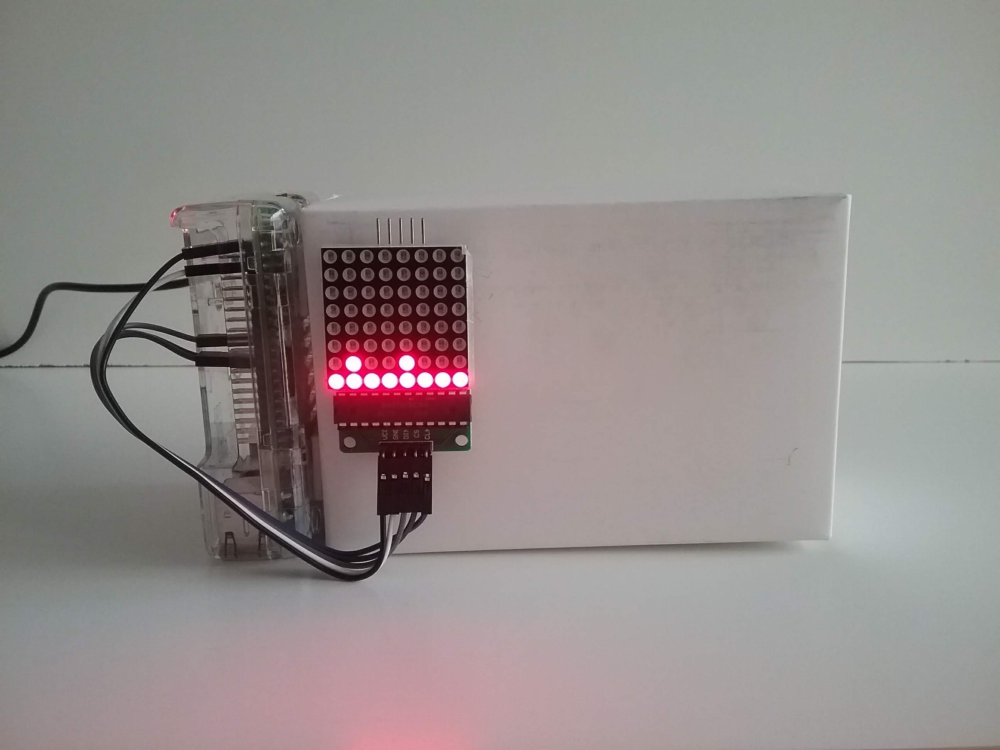 | 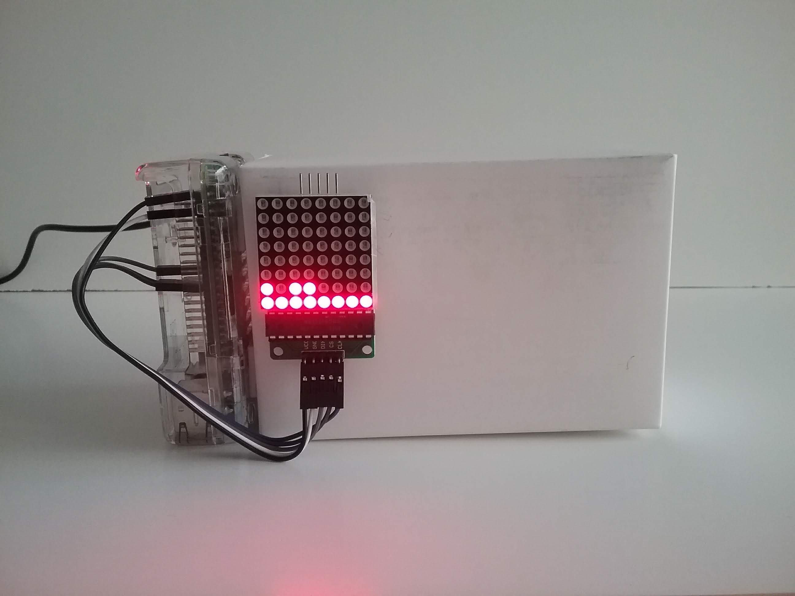 | 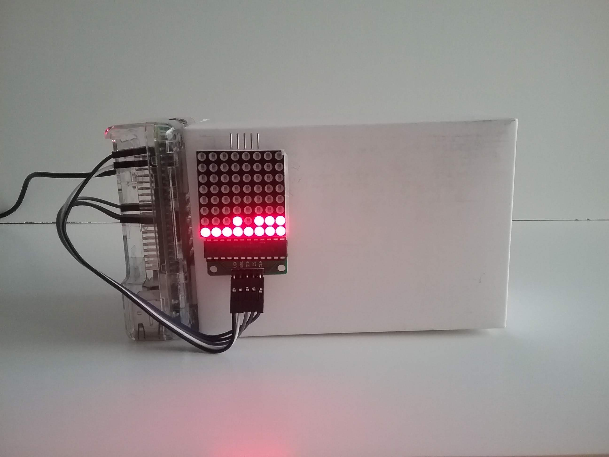 | 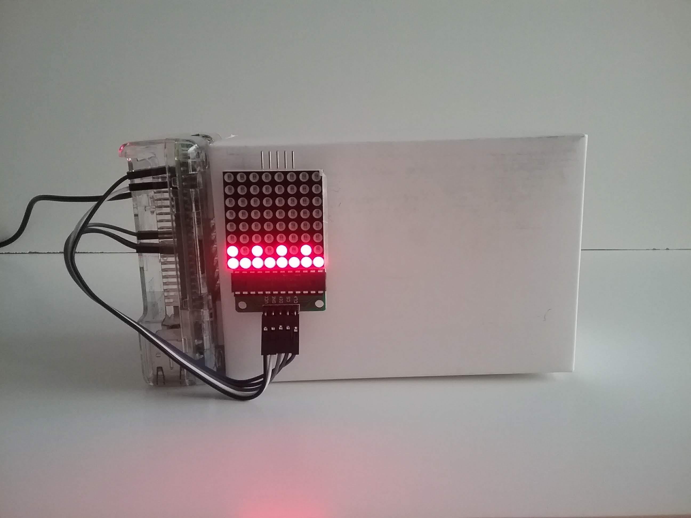 |

### Technical device

As technical device, «*When above — Alta e bassa marea*» is a remote/mobile ***tide gauge*** — aka *mareograph*, *marigraph*, *sea-level recorder*, or *limnimeter* — to measure the change in sea level — *hydrometric level*.

The device, in its core components:
- Ingests the current — and historical — hydrometric data from the Italian *[**ISPRA**](https://www.isprambiente.gov.it/en/)* - *[Rete Mareografica Nazionale - National Tidegauge Network](http://dati.isprambiente.it/)*. The Italian *ISPRA - Rete Mareografica Nazionale - National Tidegauge Network* is composed of 36 monitoring stations — powered by solar panels — located in Ancona, Anzio, Bari, Cagliari, Carloforte, Catania, Civitavecchia, Crotone, Gaeta, Genova, Ginostra, Imperia, La Spezia, Lampedusa, Livorno, Marina di Campo, Messina, Napoli, Ortona, Otranto, Palermo, Palinuro, Ponza, Porto Empedocle, Porto Torres, Ravenna, Reggio Calabria, Salerno, San Benedetto del Tronto, Sciacca, Strombolicchio, Taranto, Tremiti, Trieste, Valona, Venezia, and Vieste.
- Processes — statistically — the time series of hydrometric level measurements — throught a common data science technique of *discretization over quantiles,* which enrichs data with *historical awareness*.
- Draws — continuously and iteratively — the hydrometric levels over a low-resolution monochromatic 8X8 LED panel, composing a boolean *level matrix*, and displaying it turning on/off the LED elements.

### Emotional artwork

As aesthetical and emotional artwork, «*When above — Alta e bassa marea*» will be — in its final engineering and packaging — **a wall-mountable, portable, or even wearable** — ***tide cronograph***.
Unuseful in beating the asphyxiant *instant time* — measured in minutes, seconds, and even milliseconds — of the financial trades in  late capitalism,  a *tide cronograph* is indispensable to beat another rhythm: the quiet blues of tidal waves — *flusso* and *riflusso* — with their composite — daily and seasonal — sinusoidal breaths.  That's what Antonio Rollo calls  a «***long times' clock***»  («*[orologio dei tempi lunghi](http://www.oistros.it/quandodecidemmodicambiareilmondoconilteatro/orologio-del-tempo-lungo-installazione-pubblica-allaperto-con-fari-led-rgb-e-software-personalizzato/)*», in Italian).

>Daily tide breath in Bari, over the last day:
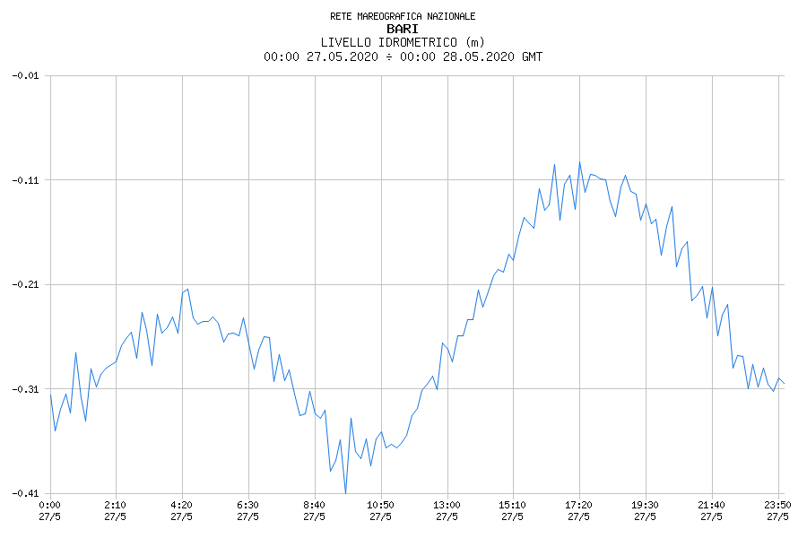

>Seasonal tide breath in Bari, over the last 12 months:


«*When above — Alta e bassa marea*» is also an urgent *timer* about the impacts of human activity on the Earth, shaped by the growing horizon of **climate change and sea level rise**, and involving territories, narratives, knowledges and practices, as John Palmesino and Ann-Sofi Rönnskog write in «[*Oceans in Transformation - When Above*](https://www.e-flux.com/architecture/oceans/331872/when-above/)». «*When above*» comes from the opening lines of the Mesopotamian creation myth Enûma Eliš, inscribed on seven clay tablets in Old Babylonian Akkadian Cuneiform language:
>«*When above, were not raised heavens;
and below on the earth a plant had not grown up;
The abyss also had not broken open their boundaries:
The chaos (or water) Tiamat (the sea) was the producing-mother of the whole of them.
Those waters at the beginning were ordained; but
a tree had not grown, a flower had not unfolded.
When the gods had not sprung up, any one of them;
a plant had not grown, and order did not exist;
Were made also the great gods,
the gods Lahmu and Lahamu they caused to come ...*»

The visual artist Grazia Tagliente is involved in making «*When above — Alta e bassa marea*» as a tangible artifact, putting togheter — in a creative assembly — LED panel, IoT electronics, and hand-made precious *gyotaku* printings wich represent typical Mediterranean fishes. Gyotaku — 魚拓, from «*gyo* (fish) and «*taku*» (impression) — is a traditional Japanese method of printmaking of fishes and sea animals, using *sumi* ink and *washi* paper.

| . | . |
| :--- | :--- | :--- | :--- |
| 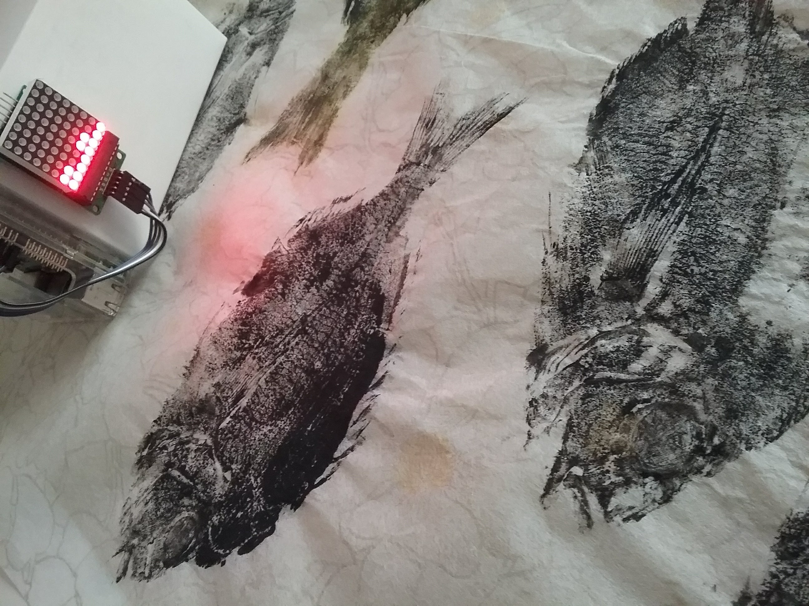 | 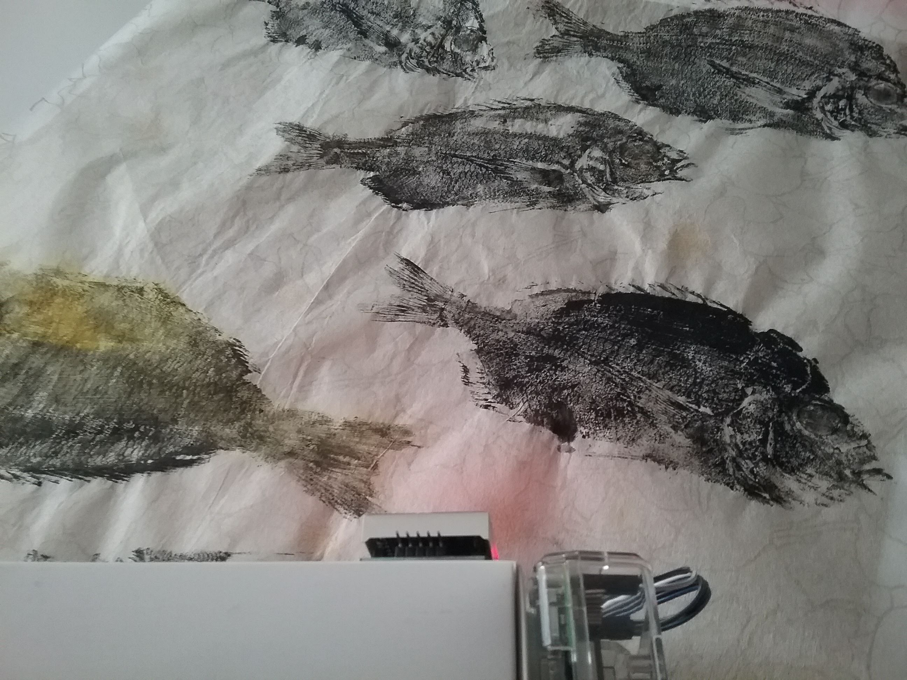 |
| 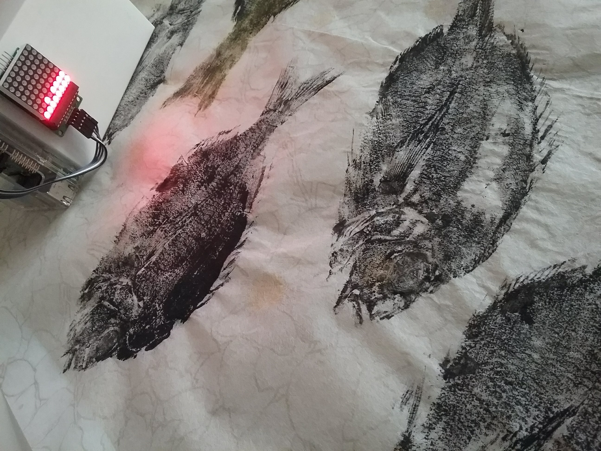 | 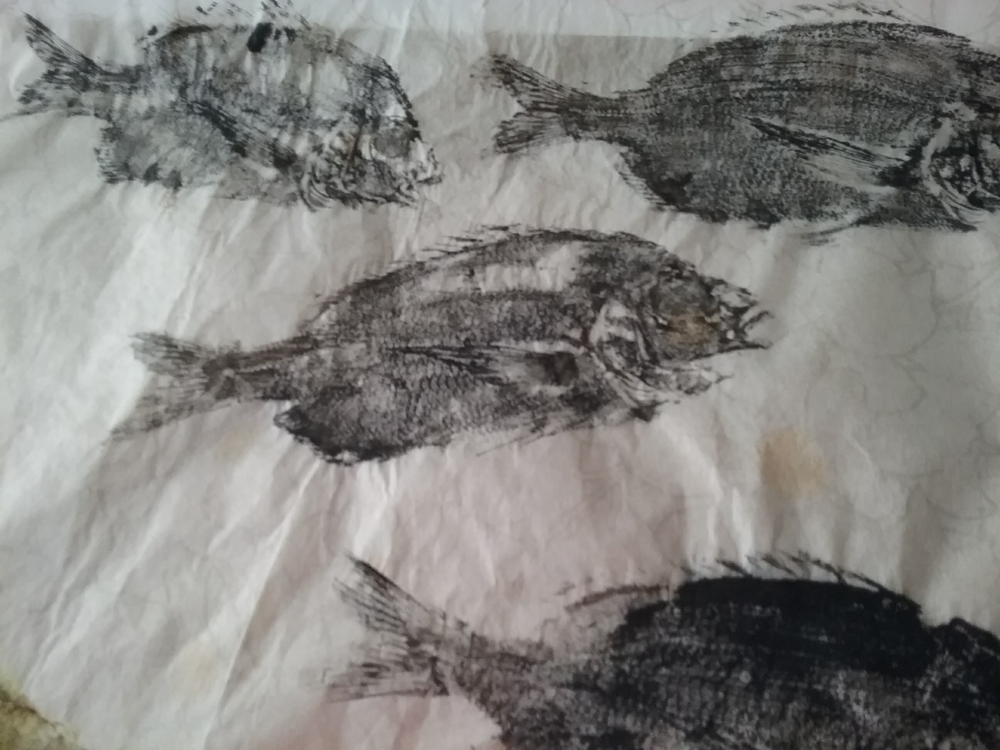 |

### HOW-TOs

#### Hardware components

Get the required hardware components:
| Component | Quantity and technical reference  |
| :---| :--- |
| 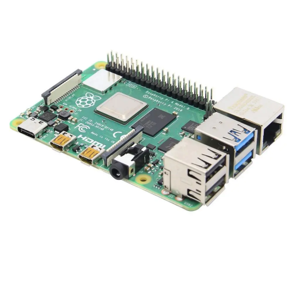 | 1 Raspberry Pi Model B single board computer (here a Raspberry Pi 4 Model B). |
| 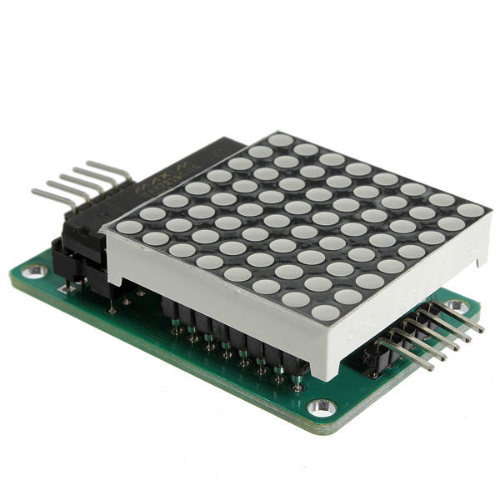 | 1 MAX7219 8x8 Dot Matrix MCU LED module. |
| 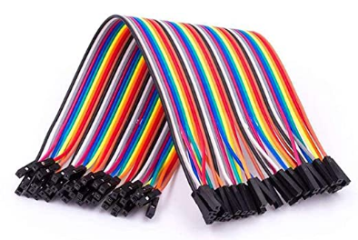 | 5 Female to Female jumper wires. |


#### Cable wiring

Connect the hardware components following this scheme:

| MAX7219 Dot Matrix LED Pin | Raspberry Pi Pin |
|:---| :---|
| **1** - VCC - +5V Power | **2** - 5V0 |
| **2** -GND - Ground | **6** - GND |
| **3** - DIN - Data In | **19** - GPIO 10 - MOSI |
| **4** - CS - Chip Select | **24** - GPIO 8 - SPI CE0 |
| **5** - CLK - Clock | **23** - GPIO 11 - SPI CLK |

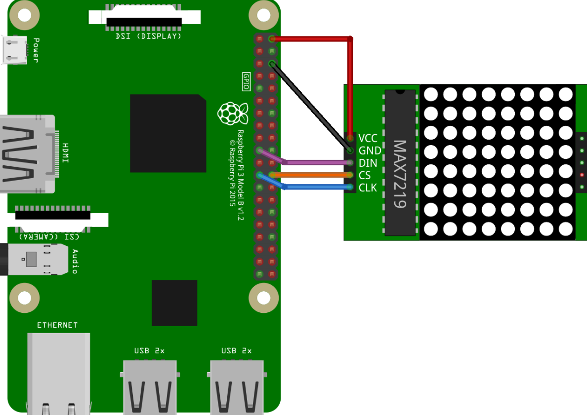

#### Raspberry Pi configuration — Enabling SPI peripheral

Turn on the Raspberry Pi SPI peripheral. The SPI peripheral is not turned on by default: to enable it, use the graphical tool *Raspberry Pi Configuration* (in *Menu > Preferences > Raspberry Pi Configuration*):

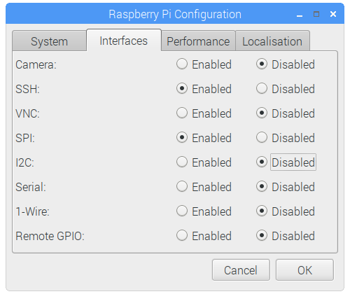

Click the *OK* button. If prompted to reboot select *Yes* so that the changes will take effect:


Alternatively, you can enable SPI peripheral by running the utility *raspi-config* in the command line:
```
sudo raspi-config
```

#### Software installation and running

Make a new directory, for GitHub projects:
```
mkdir ~/github_projects
cd ~/github_projects
```

Clone the project:
```
git clone https://github.com/antonio-viesti/mareografie.git
cd mareografie
```

Define and activate a Python virtual environment:
```
python3 -m venv ~/github_projects/mareografie/.mareografie
source ~/github_projects/mareografie/.mareografie/bin/activate
```

Install all required Python packages:
```
pip install --upgrade pip
pip install --upgrade setuptools
pip install --upgrade SPARQLWrapper
pip install --upgrade pandas
pip install --upgrade luma.led_matrix
```

Run some diagnostics on the LED panel:
```
python mareografie/led_panel/led_panel_drawings.py
```

Make sure you're connected to the internet, and run the application:
```
python mareografie/when_above.py
```

Enjoy!