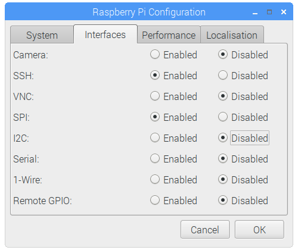

##### Mareografie (1)

# When above — Alta e bassa marea


+ [How-to](#how-to)
   - [Hardware components](#hardware-components)
   - [Cable wiring](#cable-wiring)
   - [Raspberry Pi configuration — Enabling SPI peripheral](#raspberry-pi-configuration---enabling-spi-peripheral)
   - [Software installation and running](#software-installation-and-running)

### How-to

#### Hardware components

Get the required hardware components:
| Component | Quantity and technical reference  |
| :---| :--- |
|  | 1 Raspberry Pi Model B single board computer (here a Raspberry Pi 4 Model B). |
|  | 1 MAX7219 8x8 Dot Matrix MCU LED module. |
|  | 5 Female to Female jumper wires. |

#### Cable wiring

Connect the hardware components following this scheme:

| MAX7219 Dot Matrix LED Pin | Raspberry Pi Pin |
|:---| :---|
| **1** - VCC - +5V Power | **2** - 5V0 |
| **2** -GND - Ground | **6** - GND |
| **3** - DIN - Data In | **19** - GPIO 10 - MOSI |
| **4** - CS - Chip Select | **24** - GPIO 8 - SPI CE0 |
| **5** - CLK - Clock | **23** - GPIO 11 - SPI CLK |


#### Raspberry Pi configuration — Enabling SPI peripheral

Turn on the Raspberry Pi SPI peripheral. The SPI peripheral is not turned on by default: to enable it, use the graphical tool *Raspberry Pi Configuration* (in *Menu > Preferences > Raspberry Pi Configuration*):



Click the *OK* button. If prompted to reboot select *Yes* so that the changes will take effect:


Alternatively, you can enable SPI peripheral by running the utility *raspi-config* in the command line:
```
sudo raspi-config
```

#### Software installation and running

Make a new directory, for GitHub projects:
```
mkdir ~/github_projects
cd ~/github_projects
```

Clone the project:
```
git clone https://github.com/antonio-viesti/mareografie.git
cd mareografie
```

Define and activate a Python virtual environment:
```
python3 -m venv ~/github_projects/mareografie/.mareografie
source ~/github_projects/mareografie/.mareografie/bin/activate
```

Install all required Python packages:
```
pip install --upgrade pip
pip install --upgrade setuptools
pip install --upgrade SPARQLWrapper
pip install --upgrade pandas
pip install --upgrade luma.led_matrix
```

Run some diagnostics on the LED panel:
```
python mareografie/led_panel/led_panel_drawings.py
```

Make sure you're connected to the internet, and run the application:
```
python mareografie/when_above.py
```

Enjoy!